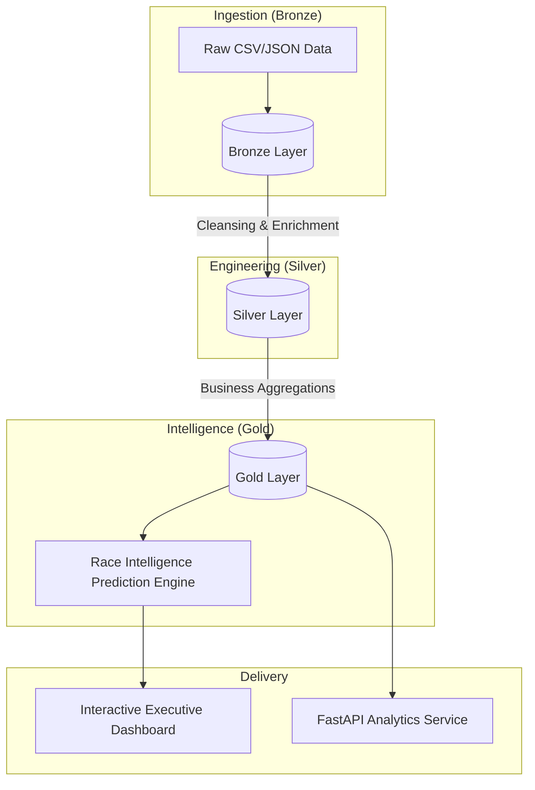

# 🏁 F1 Championship Intelligence Platform
### Enterprise Race Analytics, Strategy Intelligence & Predictive Performance Engineering

[](https://www.python.org/downloads/release/python-390/)
[](https://spark.apache.org/releases/spark-release-3-4-0.html)
[](https://delta.io/)
[](https://fastapi.tiangolo.com/)

The **F1 Championship Intelligence Platform** is an advanced analytics engineering platform designed for Formula 1 performance and strategy analysis. The system transforms race results, lap times, pit-stop analytics, and constructor performance datasets into interactive business intelligence dashboards, forecasting systems, and machine learning-driven race insights.

---

## 🏛️ System Architecture

The platform follows a rigorous **Medallion Architecture** using **Delta-style analytical storage patterns** to ensure data quality and high-speed analytical queries.



---

## 🚀 Key Intelligence Modules

### 1. Race Intelligence Prediction Engine
- **Dynamic Race Prediction**: An XGBoost ensemble that recomputes win/podium probabilities based on grid position, weather, and tire strategy.
- **SHAP Feature Importance**: Visualize the variables driving the model's decision-making.
- **Confidence Scoring**: Real-time evaluation of prediction reliability based on historical momentum.

### 2. Driver Performance Intelligence
- **Pace Consistency Matrix**: Benchmarking driver lap times against historical telemetry-inspired averages.
- **Circuit Specialization Radar**: Identifying "King of the Streets" vs. "High-Speed Specialists".
- **DNF Risk Analysis**: Predicting reliability issues based on historical failure modes.

### 3. Constructor Performance Lab
- **Reliability Analytics**: Tracking team-wide DNF trends and engine life cycles.
- **Pit Stop Optimization**: Analyzing pit crew performance deltas across the season.
- **Strategy Efficiency Index**: Measuring the delta between predicted and actual strategy outcomes.

---

## 📊 Analytics Engineering (Gold Layer)

We engineer advanced F1-specific KPIs to drive strategic decision-making:

| KPI | Category | Description |
| :--- | :--- | :--- |
| **Pace Index** | Driver | Relative pace delta vs. the seasonal average. |
| **Undercut Efficiency** | Strategy | Success rate of early pit stops vs. rivals. |
| **Consistency Score** | Driver | Standard deviation of lap times weighted by tire age. |
| **Reliability Score** | Constructor| Weighted average of DNF-free race weekends. |

---

## 🛠️ Technology Stack

- **Data Engineering**: PySpark, Delta Lake, Databricks-inspired Lakehouse concepts.
- **Machine Learning**: XGBoost (Race Prediction), Prophet (Forecasting), Scikit-Learn (K-Means).
- **Backend/API**: FastAPI, Pydantic, Uvicorn.
- **Visualization**: Streamlit (Premium Custom Theme), Plotly (Interactive Visuals).
- **BI Reporting**: Power BI (Executive dashboards & analytical storytelling).
- **Tooling**: Pytest, GitHub Actions, Mermaid.js.

---

## 🏁 Getting Started

### 1. Setup Environment
```bash
pip install -r requirements.txt
```

### 2. Process Intelligence Data
```bash
# Process Kaggle data into Medallion layers (Local Demo Mode)
python scripts/process_kaggle_local.py
```

### 3. Launch Intelligence Hub
```bash
# Start the Executive Dashboard
python -m streamlit run dashboards/streamlit_app.py
```

---

## 🧪 Testing & Validation

### Running Test Suites
```bash
# Run all data quality and unit tests
pytest tests/ -v
```

---

## 🎨 Enterprise UI: Charcoal Edition
The platform features a custom-engineered **Charcoal Theme** designed for high-density analytical workloads:
- **Lighter Dark Palette**: Uses `#121212` for reduced eye strain and better chart contrast.
- **Dynamic Headers**: Real-time status indicators for Season, Grand Prix, and Pipeline Health.
- **High-Density Metrics**: Compact KPI cards with F1-red telemetry branding.

---

## 📂 Project Structure
```text
├── .streamlit/       # Theme & Server configurations
├── configs/          # YAML pipeline schemas
├── dashboards/       # Streamlit Analytics Hub
├── data/             # Medallion Lakehouse (Raw/Bronze/Silver/Gold)
├── pipelines/        # PySpark ETL Engine
├── scripts/          # Ingestion & Local Fallback utilities
├── services/         # ML Predictors & Spark Session Manager
└── sql/              # Analytical KPI logic
```

---

## 👨‍💻 Project Maturity
This project demonstrates end-to-end expertise in:
- **Data Engineering**: Medallion architecture, Delta Lake, PySpark.
- **Machine Learning**: XGBoost ensemble prediction, Prophet forecasting, KMeans segmentation.
- **Analytics Engineering**: KPI development, data modeling, BI storytelling.
- **Full-Stack Data**: FastAPI integration and Streamlit UI engineering.

---
